# Chinmaya (Ar1es-XD)

  

  

---

### 💫 Core Focus

I build deterministic automation systems and interactive full-stack applications. My work sits at the intersection of **distributed state consistency**, **agentic workflows**, and **high-fidelity user interfaces**. I focus on removing developer friction through code generation and automating routine execution patterns.

*   🤖 **Current Initiatives**: Designing self-correcting autonomous code generator loops and Git contribution pipelines.
*   💾 **Systems Philosophy**: Clean structures, minimal dependencies, and clear separation of state.
*   🔬 **Research Areas**: Practical replication logs, LLM agent loop architectures, and consensus algorithms.

---

### 🛠️ System Capabilities

  

---

### 🏆 Systems Built

| System & Status | Technical Abstract | Stack | Interface |
| :--- | :--- | :--- | :--- |
| **Algora**   `[Active]` | Interactive algorithm visualization engine and adaptive learning sandbox designed to break down DSA step-by-step. | `Next.js` `Prisma` `Tailwind` | [Codebase](https://github.com/Ar1es-XD/Algora) |
| **EmpowerMe**   `[Active]` | Voice-driven legal translator converting dense constitutional and civil laws into clean, readable explanations. | `React` `Web Speech API` `Tailwind` | [Codebase](https://github.com/Ar1es-XD/EmpowerMe) |
| **Task Tracker**   `[Active]` | Full-stack project manager featuring calendar synchronization and secure multi-tenant isolation. | `Next.js` `Prisma` `Supabase` | [Codebase](https://github.com/Ar1es-XD/task-tracker) |
| **Shetty-Flix**   `[Legacy]` | Lightweight, dynamic media directory showcasing smooth hardware-accelerated interface layouts. | `HTML` `CSS` `JS` | [Codebase](https://github.com/The-Ar1es/Shetty-Flix) |

---

### 📊 System Telemetry

  
  

  

---

  <i>"A clean commit history is a reflection of focused thoughts."</i> 💻✨

